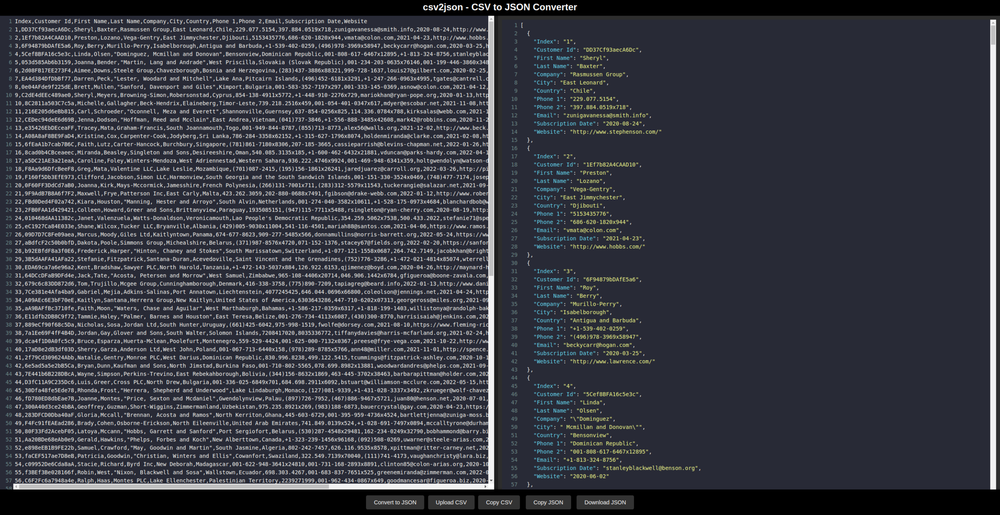

# CSV to JSON Converter

  
*(Replace with an actual screenshot of your app)*

A modern, single-page web application for converting CSV data to JSON format. Built with plain JavaScript, HTML, and CSS, this app provides a sleek and user-friendly interface for real-time CSV editing, JSON previewing, and file handling. Hosted on GitHub Pages for easy access.

👉 **Live Demo:** [csv2json](https://simkeyur.github.io/csv2json)

---

## Features

### Core Features
- **CSV Editor**  
  - Real-time editing with syntax highlighting using CodeMirror.
  - Dark mode support for better readability.
  - Upload CSV files or paste data directly into the editor.

- **JSON Preview Panel**  
  - Displays formatted and indented JSON output.
  - Syntax highlighting for better visualization.
  - Expand/collapse nested JSON objects for easier navigation.

- **Resizable Panels**  
  - Drag the center divider to dynamically resize the CSV editor and JSON preview panel.

- **File Handling**  
  - Upload `.csv` files for conversion.
  - Download the generated JSON as a `.json` file.
  - Copy CSV or JSON data to the clipboard with a single click.

- **Error Handling & Validation**  
  - Detects and highlights improperly formatted CSV.
  - Shows meaningful error messages with precise line and character positions.
  - Handles different CSV delimiters (comma, semicolon, tab, etc.).

- **Progressive Web App (PWA) Support**  
  - Installable as a PWA for offline use.
  - Includes a `manifest.json` file and service worker.
  - Provides app icons for different screen sizes.

---

## How to Use

1. **Paste or Upload CSV Data**  
   - Paste your CSV data directly into the left editor panel.
   - Alternatively, click the **Upload CSV** button to upload a `.csv` file.

2. **Convert to JSON**  
   - Click the **Convert to JSON** button to generate a JSON preview in the right panel.

3. **Preview and Edit JSON**  
   - The JSON output is formatted and syntax-highlighted for easy reading.
   - Expand or collapse nested objects for better navigation.

4. **Download or Copy JSON**  
   - Click the **Download JSON** button to save the JSON output as a `.json` file.
   - Use the **Copy JSON** button to copy the JSON data to your clipboard.

5. **Resize Panels**  
   - Drag the center divider to adjust the size of the CSV editor and JSON preview panel.

---

## Hosted on GitHub Pages

This project is hosted on GitHub Pages, making it easy to access and use directly from your browser. No installation or setup is required!

### Live Demo
👉 [https://your-username.github.io/csv-to-json-converter](https://simkeyur.github.io/csv2json)

---
